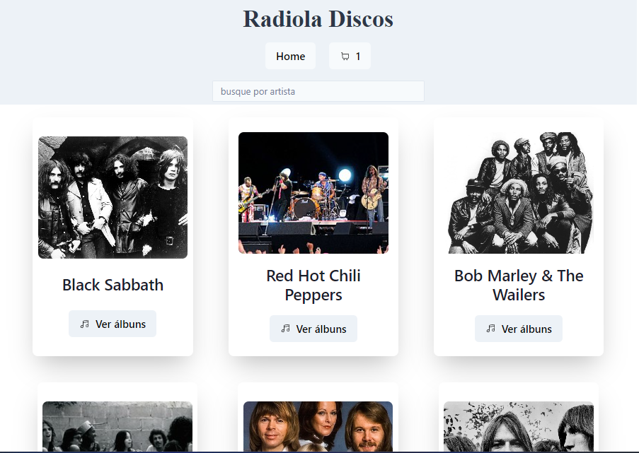
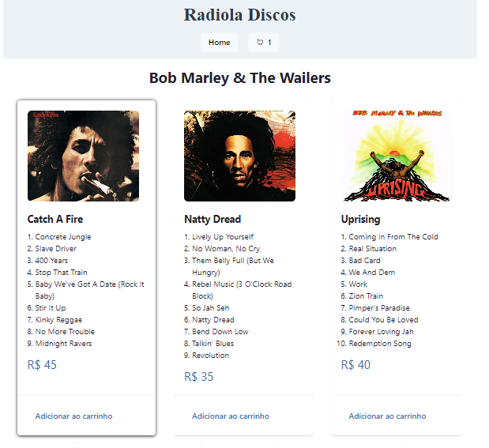
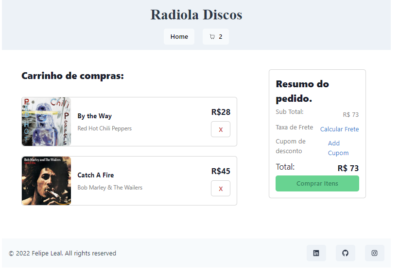

# **E-Commerce de Discos** 

Loja virtual de discos desenvolvido com intuito didático para aprofundamento nos estudos e prática em front-end, principalmente no uso do React com JavaScript, e de bibliotecas de estilização como Chakra UI.

## **Tecnologias utilizadaS**

 - React
 - Chakra UI
 - Styled Components
 - React Routes
 - React Hooks

## **Funcionalidades do Projeto**
 - [x] Visualizar artistas disponíveis e acessar lista a lista de discos de algum artista
 - [x] Procura por artista por nome
 - [x] Acesso a lista de músicas de cada discos disponível
 - [x] Adicionar disco(s) escolhido(s) ao carrinho e simular compra(s) 
 - [x] Botões de acesso a Home Page e ao Carrinho


## **Layout** 
- **Home page**

Esta é a Home Page


- **Discos**

Página dos discos disponíveis do artista selecionado


- **Cart**

Página do carrinho de compras


## **Demonstração**

[Clique aqui para acessar demonstração](https://ecommerce-discos.surge.sh/)

## **Como executar este Projeto**

```bash
 # Copie o link deste repositório e o clone em seu máquina usando o comando "git clone" em seu terminal.
 $ git clone link

 # Acesse o diretório deste projeto com o comando "cd" em seu terminal e instale as dependências necessárias com o comando "npm install".
 $ cd nome-do-diretório
 $ npm install

 # Execute este projeto com o comando "npm run start" em seu terminal.
 $ npm run start
```

 ## **Autor**

 

 Felipe Freitas Leal
 
 <a href="https://www.linkedin.com/in/felipe-freitas-leal/">Linkedin</a>
