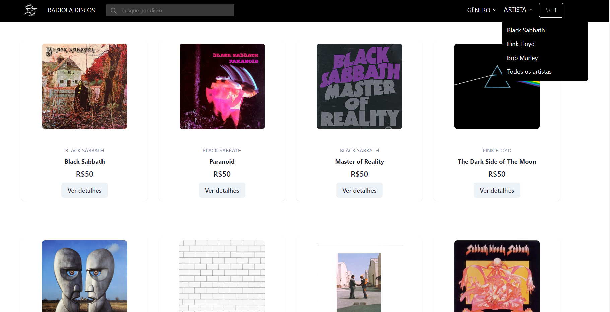
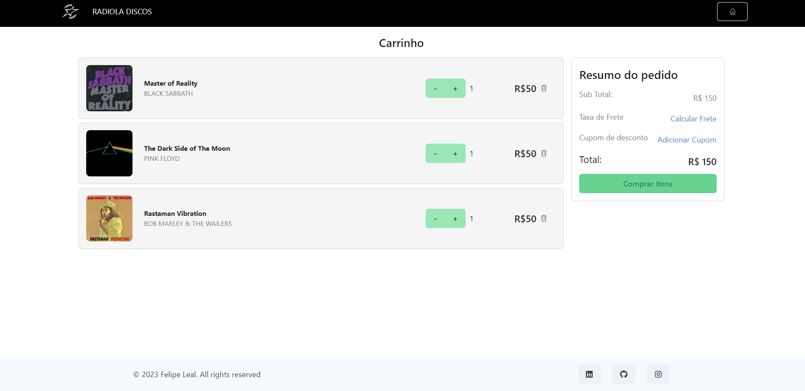

# **E-Commerce Radiola Discos** 

## **Back-End:**

https://github.com/Felipe-Freitasleal/radiola-back

## **Web-Scraping:**

https://github.com/Felipe-Freitasleal/webscraping-musics

## **Tecnologias utilizadas no Front**

- React
- Chakra UI
- Styled Components
- React Routes
- React Hooks
- Swiper
- Axios

## **Funcionalidades do Projeto**

- Visualizar discos disponíveis e acessar detalhes acerca
- Procurar por disco/artista por nome ou gênero
- Acesso a lista de músicas de cada discos disponível
- Adicionar disco(s) escolhido(s) ao carrinho e simular compra
- Botões de acesso a Home Page e ao Carrinho
- Botões para filtragem por artista e gênero

## **Layout**

- **Home page**
  
  &nbsp;

- **Carrinho de compras**
  
  &nbsp;

## **Demonstração**

[Clique aqui para acessar demonstração]()

## **Como executar este Projeto**

```bash
 # Copie o link deste repositório e o clone em seu máquina usando o comando "git clone" em seu terminal.
 $ git clone link

 # Acesse o diretório deste projeto com o comando "cd" em seu terminal e instale as dependências necessárias com o comando "npm install".
 $ cd nome-do-diretório
 $ npm install

 # Execute este projeto com o comando "npm run start" em seu terminal.
 $ npm run start
```

## **Autor**

Felipe Leal

<a href="https://www.linkedin.com/in/felipe-freitas-leal/">Linkedin</a>
